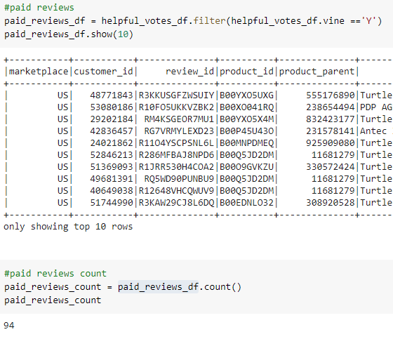
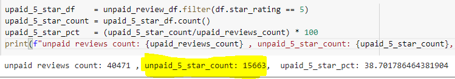

# Amazon_Vine_Analysis

### Purpose:
Amazon Vine Analysis determines if there's any biased based on paid vs unpaid reviews on Video Games.

## Resources:
1. Datasets : VideoGames
1. Technologies:GoogleCoLab, PySpark, AWS S3, AWS RDS (PostGres).

## Results:

### Total Reviews:

#### Total Vine Reviews Count:
  
  
#### Total Non-Vine Reviews:
  
  
### Total Number of 5-Star Reviews:

#### Vine Reviews:
   

#### Non Vine Reviews:
   
   
### Percentage 5-Star Reviews:

#### Vine Percentage:
   
   
#### Non-Vine Percentage:
  

## Summary:
51% of the reviews in the Vine program are 5 stars reviews whereas only 39% reviews are non-Vine. 
This describes a positivity bias in the Vine review program.

### Other Recommendations:
1. Satistical distributions like mean, median and mode.
1. Plotting the boxplots helps to visualize the rating patterns between Vine vs Non-Vine.
1. Also doing the same analysis with 4-star rating might also help to determine the bais.

  
    
    

